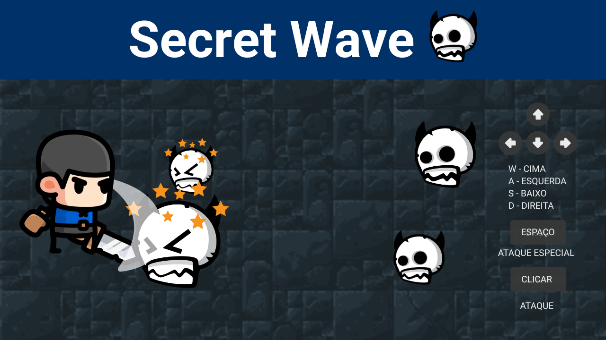
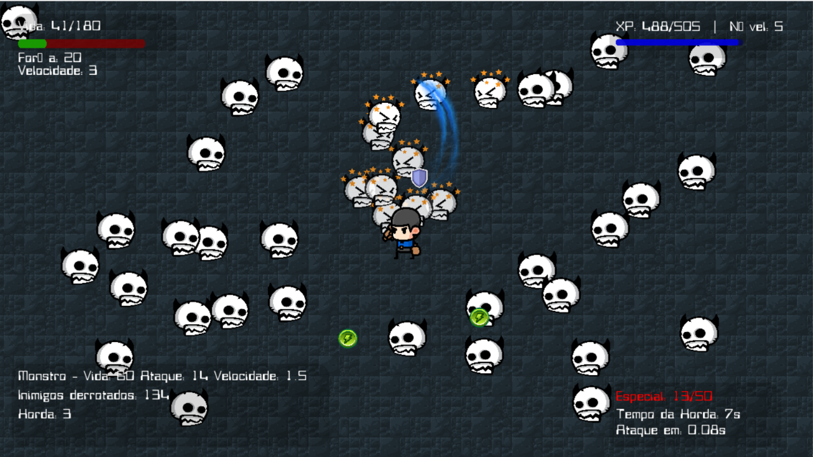
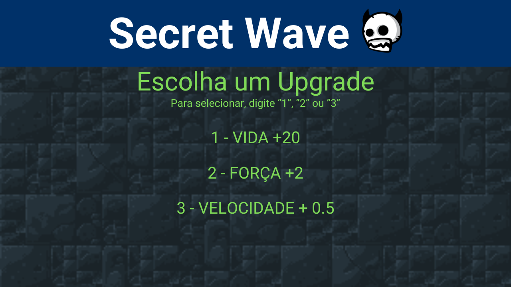
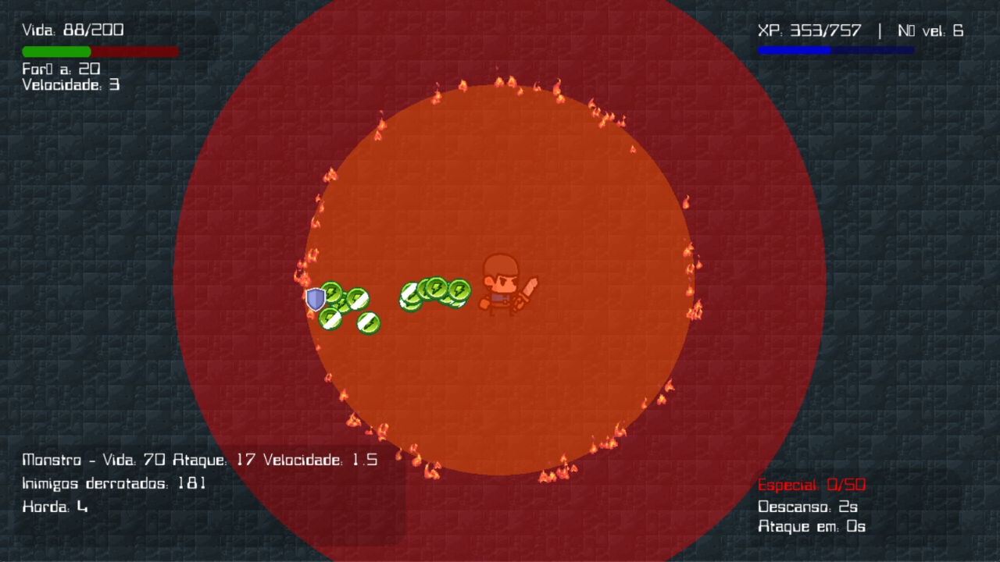
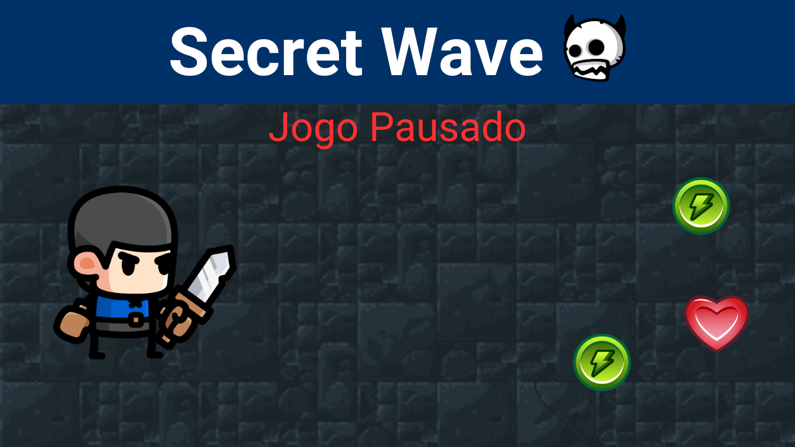
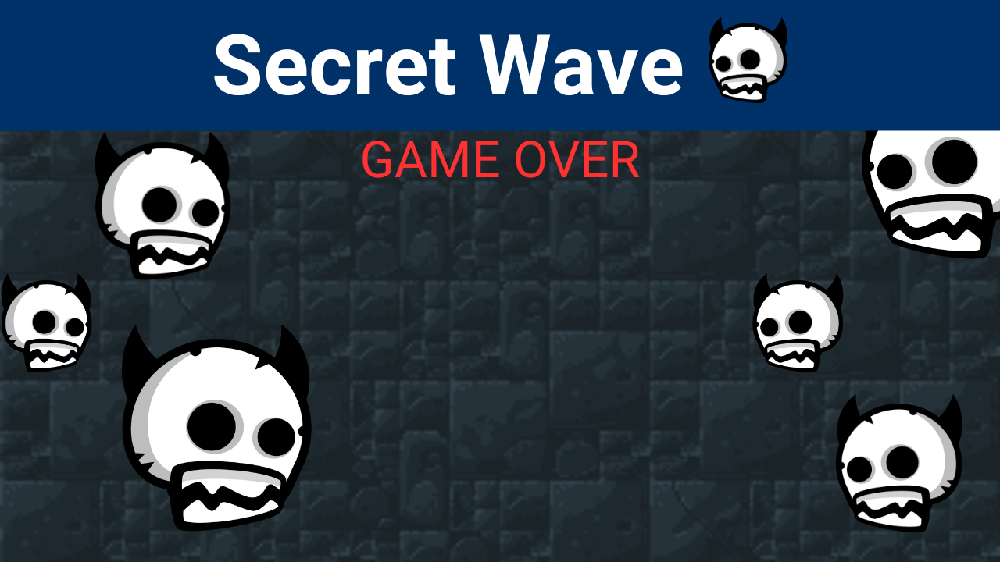
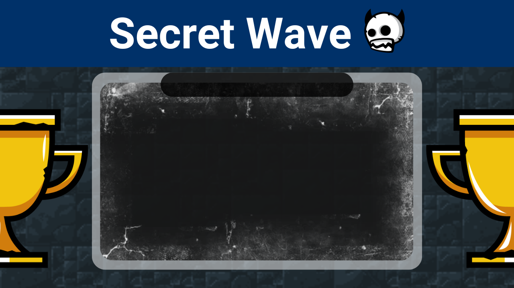

<h1 align="center">
 🎮 Hack'n'Slash - Secret Wave
</h1>

Um jogo 2D de ação desenvolvido em **Python** com **Pygame**, onde o jogador controla um herói em um mundo repleto de monstros.  
O jogo inclui sistema de **combate**, **evolução de personagem**, **waves progressivas** e um **leaderboard competitivo**.

---

<h3 align="center">
 🧑‍💻 1. HUD do Jogador  
</h3>

<div align="center">
  
  
</div>

<h4 align="center">
Exibe informações vitais do personagem:
- ❤️ Vida: 12/103
- 💪 Força: 8
- 🏃 Velocidade: 35

Também mostra o nível atual e o progresso da wave.
</h3>

---
<h3 align="center">
 🔧 2. Menu de Evolução  
</h3>

<div align="center">
  
</div>

<h4 align="center">
Quando o jogador acumula **XP suficiente**, pode escolher entre:
1. ➕ +20 Vida
2. ➕ +2 Força
3. ➕ +0.5 Velocidade
</h4>

---

<h3 align="center">
 🔧 3. Ataque Especial 
</h3>

<div align="center">
  
</div>

<h4 align="center">
Quando o jogador acumula **Pontos o suficiente**, pode ativar o ataque especial SPACE
</h4>

---

<h3 align="center">
 🔧 4. Jogo Pausado
</h3>

<div align="center">
  
</div>

<h4 align="center">
Quando o jogador optar, pode apertar ESC para pausar o jogo
</h4>

---

<h3 align="center">
 ☠️ 5. Tela de Game Over  
</h3>

<div align="center">
  
</div>

<h4 align="center">
Ao morrer, o jogador vê:

- Estatísticas da partida (tempo, wave alcançada, nível máximo)

- Opção para digitar seu nome e salvar no leaderboard

- Botões para voltar ao menu ou sair do jogo

</h4>

---

<h3 align="center">
 🏆 6. Leaderboard
</h3>

<div align="center">
  
</div>

<h4 align="center">
Ranking dos melhores jogadores com:
- Nome
- Pontuação
- Data do recorde
- Botão para voltar ao menu
</h4>

---
<h3 align="center">
 🛠️ Funcionalidades Principais
</h3>

<h4 align="center">
- ⚔️ **Sistema de Combate**: Ataques básicos e habilidade especial.

- 📈 **Progressão**: Evolução de atributos (vida, força, velocidade).

- 🌊 **Waves**: Inimigos com dificuldade progressiva.

- 💾 **Persistência**: Leaderboard salvo em arquivo `.json`.

- 🖥️ **Build Executável**: Versão compilada para Windows (`.exe`).

</h4>

---

<h3 align="center">
 📥 Como Jogar
</h3>

<h4 align="center">

 🎮 Controles
- **WASD**: Movimento

- **Clique do Mouse**: Ataque básico

- **Espaço**: Habilidade especial

 🚀 Execução
```bash
python main.py
```

</h4>

---

<h3 align="center">
📌 Destaques Técnicos
</h3>

🗂️ Arquitetura modular (separação em jogador.py, monstro.py, waves.py).

💾 Sistema de save/load para o leaderboard.

✨ Efeitos visuais de dano e animações fluidas.

🛠️ Build automatizada com PyInstaller.

```bash
HacknSlash-SecretWave/                         
│
├── assets/             
│   └── Drop/   
│           └── Vida/
│                     └── Vida_1.png
│                     └── Vida_2.png
│                     └── Vida_3.png
│                     └── Vida_4.png
│                     └── Vida_5.png
│                     └── Vida_6.png
│                     └── Vida_7.png
│                     └── Vida_8.png
│           └── XP/
│                     └── XP_1.png
│                     └── XP_2.png
│                     └── XP_3.png
│                     └── XP_4.png
│                     └── XP_5.png
│                     └── XP_6.png
│                     └── XP_7.png
│                     └── XP_8.png
│                     └── XP_9.png
│                     └── XP_10.png             
│   └── Efeito_espada/   
│           └── Corte_1.png
│           └── Corte_2.png
│           └── Corte_3.png
│           └── Corte_4.png
│           └── Corte_5.png
│           └── Corte_6.png        
│   └── Fogo/   
│           └── Fogo_1.png
│           └── Fogo_2.png
│           └── Fogo_3.png
│           └── Fogo_4.png
│           └── Fogo_5.png
│           └── Fogo_6.png   
│           └── Fogo_7.png
│           └── Fogo_8.png
│           └── Fogo_9.png
│           └── Fogo_10.png
│           └── Fogo_11.png
│           └── Fogo_12.png   
│   └── fonts/  
|            └── Bitwise.ttf
│   └── Heroi/
│           └── 01-Parado/
│                     └── Parado_1.png
│                     └── Parado_2.png
│                     └── Parado_3.png
│                     └── Parado_4.png
│                     └── Parado_5.png
│                     └── Parado_6.png
│                     └── Parado_7.png
│                     └── Parado_8.png
│                     └── Parado_9.png
│                     └── Parado_10.png
│                     └── Parado_11.png
│                     └── Parado_12.png
│           └── 02-Corrida/
│                     └── Corrida_1.png
│                     └── Corrida_2.png
│                     └── Corrida_3.png
│                     └── Corrida_4.png
│                     └── Corrida_5.png
│                     └── Corrida_6.png
│                     └── Corrida_7.png
│                     └── Corrida_8.png
│                     └── Corrida_9.png
│                     └── Corrida_10.png
│           └── 03-Ataque/
│                     └── No_Effect/
│                     			└── Ataque_1.png
│                     			└── Ataque_2.png
│                     			└── Ataque_3.png
│                     			└── Ataque_4.png
│                     			└── Ataque_5.png
│                     			└── Ataque_6.png
│                     			└── Ataque_7.png
│                     			└── Ataque_8.png
│           └── 04-Dano/
│                     └── Dano_1.png
│                     └── Dano_2.png
│                     └── Dano_3.png
│                     └── Dano_4.png
│                     └── Dano_5.png
│                     └── Dano_6.png
│           └── 05-Morte/
│                     └── Morte_1.png
│                     └── Morte_2.png
│                     └── Morte_3.png
│                     └── Morte_4.png
│                     └── Morte_5.png
│                     └── Morte_6.png
│                     └── Morte_7.png
│                     └── Morte_8.png
│   └── Menu/
│           └── Menu_1.png
│           └── Menu_2.png
│           └── Menu_3.png
│           └── Menu_4.png
│           └── Menu_5.png
│           └── trofeu_1.png
│   └── Monstro/
│           └── Monstro_Andando/
│                     └── Andando_1.png
│                     └── Andando_2.png
│           └── Monstro_Hit/
│                     └── hit_6.png
│   └── Mouse/
│           └── Click/
│                     └── Click_1.png
│           └── Idle/
│                     └── Indle_1.png
│   └── Sons/
│           └── ataque.mp3
│           └── fire_ataque.mp3
│           └── game_over.mp3
│           └── level_up.mp3
│           └── musica_fundo.mp3
│           └── start.mp3
│   └── fundo_tile.png  
│   └── icon.png     
│   └── icon.ico                
│
│
├── configuracoes.py                          
├── funcoes.py                       
├── hud.py                          
├── jogador.py                       
├── main.ico                    
├── monstro.spec                  
├── README.md                      
└── waves.py   
└── leaderboard.json                
```

<h3 align="center">
🧠 Lógica de Jogo
</h3>

🛡️ O herói começa com 100 de vida.

🖱️ Cada golpe com o clique do mouse realiza um ataque que causa dano aos inimigos.

⭐ Ao atingir 50 pontos, o herói pode realizar um ataque especial.

🌊 Os monstros surgem em ondas (waves), cada uma com:

15 segundos de combate

5 segundos de descanso

🏆 Cada monstro derrotado concede XP ao herói, que sobe de nível:

Inicialmente precisa de 100 XP

Depois, a necessidade aumenta conforme evolui.

➕ Ao subir de nível, o herói pode escolher entre:

Aumentar a vida

Aumentar a força

Aumentar a velocidade

💾 Ao final do jogo, as pontuações e nomes são armazenados em um arquivo .json para exibição no placar.


